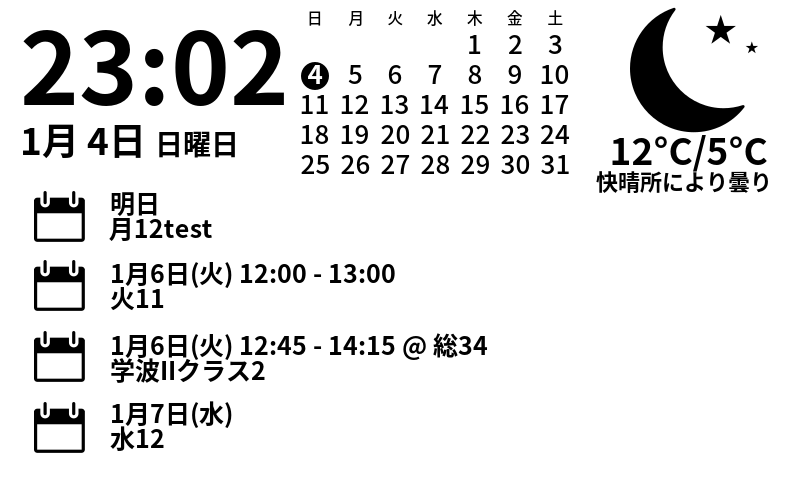
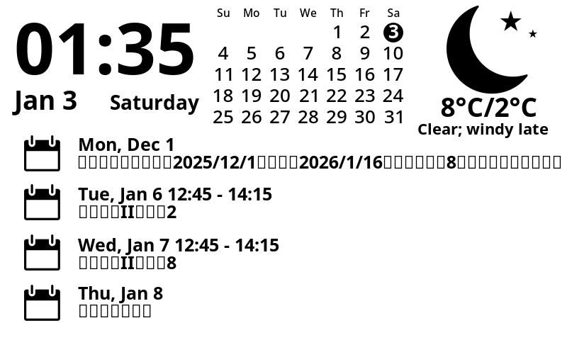
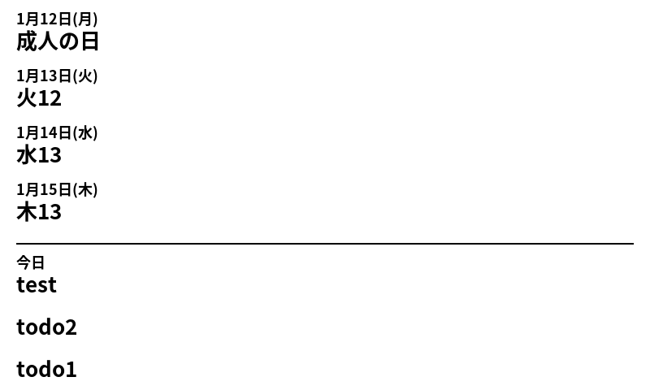

# ラズパイ＋電子ペーパーで電子フォトフレーム (時刻、天気、カレンダー、予定表)

日本語表示の調整のほか、CalDAVの複数のカレンダーやTODOに対応させ、以下の２つのレイアウトを新たに追加しました。

## 準備するもの
- [Raspberry Pi Zero 2 WH](https://amzn.to/44UxA1P)
- [Waveshare ePaper 7.5 Inch HAT](https://amzn.to/4qunFrT)
- 起動用micro sdメモリ
- 電源供給用micro USBケーブル
- フォトフレーム18x13cm（百均サイズ）

## メリット
- 低電力（モバイルバッテリー駆動可）

## デメリット
- ePaperが高価

## SCREEN_LAYOUT=6



## SCREEN_LAYOUT=7


# About this fork
I've made the following modifications: 
1. Import MULTIPLE caldav (owncloud) calendars: CALDAV_CALENDAR_URLS
2. Fixes for caldav (owncloud) features
3. A new layout with a b/w calendar: SCREEN_LAYOUT=6
4. Japanese adaptation for date format and VisualCrossing description: LANG=ja_JP.utf8
5. Another new layout just for CalDAV EVENTs and TODOs: SCREEN_LAYOUT=7
 
## purchase
- [Raspberry Pi Zero 2 WH](https://amzn.to/44UxA1P)
- [Waveshare ePaper 7.5 Inch HAT](https://amzn.to/4qunFrT)

## installation
The original procedure was not fully compatible with the Raspberry Pi Zero 2 WH. I installed Pi OS Lite (64bit) using Imager v2.0.3 for Windows. 
```
git clone --recursive https://github.com/takyaO/waveshare-epaper-display.git  
cd waveshare-epaper-display  
sudo apt install python3-lxml python3-pillow
python3 -m venv .venv --system-site-packages
source .venv/bin/activate
pip install -r requirements.txt
```

## env.sh

```
export VISUALCROSSING_APIKEY=xxxxxxxxxxxxxxxxxxxxx
export WEATHER_LATITUDE=34.7144192
export WEATHER_LONGITUDE=137.7140736 
export WEATHER_FORMAT=CELSIUS

export CALDAV_CALENDAR_URLS="
http://x.y.z.w/owncloud/remote.php/dav/calendars/xxxxx/personal/
http://x.y.z.w/owncloud/remote.php/dav/calendars/xxxxx/-/
http://x.y.z.w/owncloud/remote.php/dav/calendars/xxxxx/--1/
http://x.y.z.w/owncloud/remote.php/dav/calendars/xxxxx/--2/
"
export CALDAV_USERNAME=xxxxxxxxx
export CALDAV_PASSWORD=xxxxxxxxx

export WAVESHARE_EPD75_VERSION=2
export SCREEN_LAYOUT=6
export WEATHER_TTL=3600
export LANG=ja_JP.utf8
export LOG_LEVEL=INFO
export PRIVACY_MODE_XKCD=0
export PRIVACY_MODE_LITERATURE_CLOCK=0
```


## run
./run.sh

----
Instructions on setting up a Raspberry Pi Zero WH with a Waveshare ePaper 7.5 Inch HAT.
The screen will display date, time, weather icon with high and low, and calendar entries.

  

- [Shopping list](#shopping-list)
- [Setup the PI](#setup-the-pi)
- [Using this application](#using-this-application)
- [Setup dependencies](#setup-dependencies)
- [Weather and calendar configuration](#weather-and-calendar-configuration)
- [Pick a layout](#pick-a-layout)
- [Run it](#run-it)
  - [Automate it](#automate-it)
- [Adding custom data](#custom-data)
- [Choosing a different language](#how-to-use-a-different-display-language)
- [Choosing a different font](#how-to-use-a-different-font)
- [Privacy Mode](#privacy-mode)
- [Troubleshooting](#troubleshooting)
- [Waveshare documentation and sample code](#waveshare-documentation-and-sample-code)
- [Debugging locally](#debugging-locally)


## Shopping list

[Waveshare 7.5 inch epaper display HAT 640x384](https://www.amazon.co.uk/gp/product/B075R4QY3L/)  
[Raspberry Pi Zero WH (presoldered header)](https://www.amazon.co.uk/gp/product/B07BHMRTTY/)  
[microSDHC card](https://www.amazon.co.uk/gp/product/B073K14CVB)  

Optional - a picture frame. I used a [18x13cm (7x5 inch) frame](https://www.tescophoto.com/harriet-photo-frame) which just about fits the screen.

## Setup the PI

### Prepare the Pi

Use the [Raspberry Pi imager](https://www.raspberrypi.com/software/) and install Raspberry Pi OS (tested with Raspberry Pi OS Lite, October 2023 edition).   

Ensure that you have SSH access, or direct access, to the Raspberry Pi, and that it can connect to the Internet to download packages. In most cases you would do this via the imager's settings screen: set the username and password, enable SSH and set up WiFi access. 


### Connect the display

Turn the Pi off, then put the HAT on top of the Pi's GPIO pins.

Connect the ribbon from the epaper display to the extension.  To do this you will need to lift the black latch at the back of the connector, insert the ribbon slowly, then push the latch down.  

Now turn the Pi back on and SSH into it.  


## Using this application

### Clone it

git clone this repository in the `/home/pi` directory.

    cd ~
    sudo apt update && sudo apt upgrade
    sudo apt install git
    git clone --recursive https://github.com/mendhak/waveshare-epaper-display.git

This should create a `/home/pi/waveshare-epaper-display` directory.

### Setup dependencies

    cd waveshare-epaper-display
    sudo apt install gsfonts fonts-noto python3 python3-pip pigpio libopenjp2-7 python3-venv libjpeg-dev libxslt1-dev fontconfig libcairo2
    python3 -m venv --system-site-packages .venv
    .venv/bin/pip3 install -r requirements.txt
    sudo raspi-config nonint do_spi 0  #This enables SPI
    sudo reboot


### Waveshare version

Copy `env.sh.sample` (example environment variables) to `env.sh`

Modify the `env.sh` file and set the version of your Waveshare 7.5" e-Paper Module  (newer ones are version 2, red one is 2B)

    export WAVESHARE_EPD75_VERSION=2

## Weather and calendar configuration

The display uses [VisualCrossing](https://www.visualcrossing.com/) for weather. Set its API key, your location, and temperature format in `env.sh`:

    export VISUALCROSSING_APIKEY=your-api-key
    export WEATHER_LATITUDE=34.7144192
    export WEATHER_LONGITUDE=137.7140736
    export WEATHER_FORMAT=CELSIUS

Calendar events and TODOs are read from CalDAV. Set one or more calendar URLs, separated by whitespace, along with the account credentials:

    export CALDAV_CALENDAR_URLS="https://example.com/dav/calendar/"
    export CALDAV_USERNAME=username
    export CALDAV_PASSWORD=password

If `CALDAV_CALENDAR_URLS` is empty, the display simply omits calendar events and TODOs. Google Calendar, ICS, Outlook, alternate weather providers, and weather alerts are not supported by this configuration.

## Pick a layout

This is an optional step.  There are a few different layouts to choose from.


| `export SCREEN_LAYOUT=1` <br />This is the default | `export SCREEN_LAYOUT=2` <br />More calendar entries and less emphasis on weather and time |
| --- | --- |
| [](screenshots/001.png) | [](screenshots/002.png) |

| `export SCREEN_LAYOUT=3` <br />Calendar entries on left, less emphasis on weather | `export SCREEN_LAYOUT=4` <br />Shows hour instead of time. Meant for color screens. |
| --- | --- |
| [](screenshots/003.png) | [](screenshots/004.png) |

| `export SCREEN_LAYOUT=5` <br />Calendar entries on left, with a month calendar for at-a-glance |  |
| --- | --- |
| [](screenshots/005.png) | |


## Run it

Run `./run.sh` to fetch VisualCrossing weather and, when configured, CalDAV events and TODOs.  It will then create a png, convert to a 1-bit black and white bmp, then display the bmp on screen.

Using a 1-bit, low grade BMP is what allows the screen to refresh relatively quickly. Calling the BCM code to do it takes about 6 seconds.
Rendering a high quality PNG or JPG and rendering to screen with Python takes about 35 seconds.

### Automate it

Once you've proven that the run works, and an image is sent to your epaper display, you can automate it by setting up a cronjob.

    crontab -e

Add this entry so it runs every minute:

    * * * * * cd /home/pi/waveshare-epaper-display && bash run.sh > run.log 2>&1

This will cause the script to run every minute, and write the output as well as errors to the run.log file.

Alternatively, you can use a systemd timer. There are example systemd units available to install a timer
that starts a service every minute that runs the script. To achieve this, execute the following commands.

    mkdir -p ~/.config/systemd/user/
    cp waveshare-epaper-display.service.example ~/.config/systemd/user/waveshare-epaper-display.service
    cp waveshare-epaper-display.timer.example ~/.config/systemd/user/waveshare-epaper-display.timer
    systemctl --user daemon-reload
    systemctl --user enable waveshare-epaper-display.timer
    loginctl enable-linger

## Custom Data

This is an optional step, to add your own custom data to the screen.  For example this could be API calls, data from Home Assistant, PiHole stats, or something external.

Rename `screen-custom-get.py.sample` to `screen-custom-get.py`. Do your custom code, and set the value of `custom_value_1` to the value you want to display. Run `./run.sh` and it'll appear on screen.

Next, modify `screen-custom.svg` and change the various x, y, font size values to adjust its appearance and position.
You can add more values by adding more SVG elements for custom_value_2, custom_value_3, and so on, and set its value in the `output_dict` in `screen-custom.get.py`.

## How to use a different display language

The default locale of the system will be used to generate the time and date formats, including month and day names.  On Raspberry Pi OS the default is usually `en_GB`.  

Use the following instructions to install and try out other locales, or even force en_GB. 

To see the current default locale, run `locale`.  
To see all the locales installed on the system, use `locale -a`.  

To install a new locale, go through the locale wizard:

    sudo dpkg-reconfigure locales

Select the locales you want to install, be sure to pick the ones that have `.UTF-8` in the name. 

Edit the `env.sh` file and at the top, set the language like so: 

    export LANG=ko_KR.UTF-8

The next time `run.sh` runs, the output should have the chosen language.

### Fonts for non-western languages

Some languages may not render well because the default Raspberry Pi system fonts don't have all the characters needed to display on screen. For such cases, you'll need to find and install a font that supports all the characters you want to display. 

Chinese/Japanese/Korean should already be taken care of by installing the `fonts-noto` package. But sometimes just installing that isn't enough, you'll also have to set it as the default font, see the [font instructions](#how-to-use-a-different-font). 

The reason this is necessary: the SVG renderer [does not support fallback fonts](https://github.com/Kozea/CairoSVG/issues/72#issuecomment-132500219) which means that if a font doesn't have a certain character, it won't ask the system for other fonts to help plug the gaps. You'll just see squares. 


## How to use a different font

The default font is set to `sans-serif` which on a Raspberry Pi defaults to DejaVu Sans. It's a decent font, wide, and visible, and works for most western languages.  

In this example I'll replace it with Noto Sans. 
First run this command, it will show the current font being used. 

```
$ fc-match sans-serif
DejaVuSans.ttf: "DejaVu Sans" "Book"
```

Install Noto fonts.

```
sudo apt install fonts-noto
```

Now create a font config file if it doesn't already exist. 

```
mkdir -p ~/.config/fontconfig/conf.d
nano ~/.config/fontconfig/conf.d/00-fonts.conf
```

Set the contents of the 00-fonts.conf file:

```xml
<?xml version='1.0'?>
<!DOCTYPE fontconfig SYSTEM 'fonts.dtd'>
<fontconfig>
  <alias>
    <family>sans-serif</family>
    <prefer>
        <family>Noto Sans</family>
    </prefer>
  </alias>
</fontconfig>
```

This tells the system to prefer 'Noto Sans' if the 'sans-serif' family is requested. You can test it by running:

```
$ fc-match sans-serif
NotoSans-Regular.ttf: "Noto Sans" "Regular"
```

The next time `run.sh` runs, the output image should have the chosen font.

## Privacy Mode

This mode hides away everything and just displays an XKCD comic or a literary quote for the time.  In env.sh, set: 


| `export PRIVACY_MODE_XKCD=1` <br />XKCD comic | `export PRIVACY_MODE_LITERATURE_CLOCK=1` <br />Literature clock mode |
| --- | --- |
| [](screenshots/pvt_xkcd.png) | [](screenshots/pvt_literature.png) |


## Troubleshooting

If the scripts don't work at all, try going through the Waveshare sample code linked below - if you can get those working, this script should work for you too.

You may want to further troubleshoot if you're seeing or not seeing something expected.
If you've set up the cron job as shown above, a `run.log` file will appear which contains some info and errors.
If there isn't enough information in there, you can set `export LOG_LEVEL=DEBUG` in the `env.sh` and the `run.log` will contain even more information.

The weather response is cached to avoid hitting the weather API unnecessarily.
If you want to force a weather update, you can delete the `cache_weather.json`.


## Waveshare documentation and sample code

Waveshare have a [user manual](https://www.waveshare.com/w/upload/7/74/7.5inch-e-paper-hat-user-manual-en.pdf) which you can get to from [their Wiki](https://www.waveshare.com/wiki/7.5inch_e-Paper_HAT)


The [Waveshare demo repo is here](https://github.com/waveshare/e-Paper).  Assuming all dependencies are installed, these demos should work.

    git clone https://github.com/waveshare/e-Paper
    cd e-Paper


This is the best place to start for troubleshooting - try to make sure the examples given in their repo works for you.

[Readme for the C demo](https://github.com/waveshare/e-Paper/blob/master/RaspberryPi_JetsonNano/c/readme_EN.txt)

[Readme for the Python demo](https://github.com/waveshare/e-Paper/blob/master/RaspberryPi_JetsonNano/python/readme_jetson_EN.txt)


## Debugging locally

It's possible to run and debug the application locally with virtual environments.  The last step fails, as it's trying to write to GPIO, but that's not an issue since the aim of local development is to generate and view the `screen-output.png`.

Do this before opening VSCode:

```bash
# Generate the virtual environment directory
python3 -m venv .venv
# Switch to it
source .venv/bin/activate
# Install dependencies
pip install -r requirements.txt
```

Then, open VSCode with the project, and it should automatically detect and switch to the virtual environment in the terminal.

To run the project, just run `./run.sh`.  It will pick up env.sh variables, and run the various Python scripts.

To debug the project, open a Python script file such as `screen-calendar-get.py` or `screen-weather-get.py`, and press F5.  It will generate a .env from env.sh, and run the script.  It can hit breakpoints, no problem.
